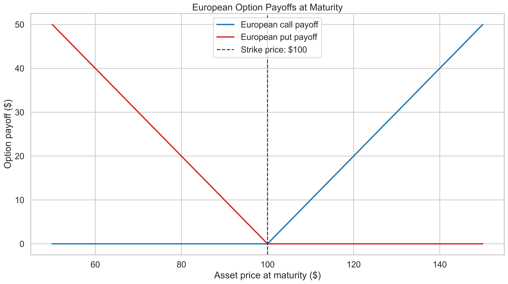
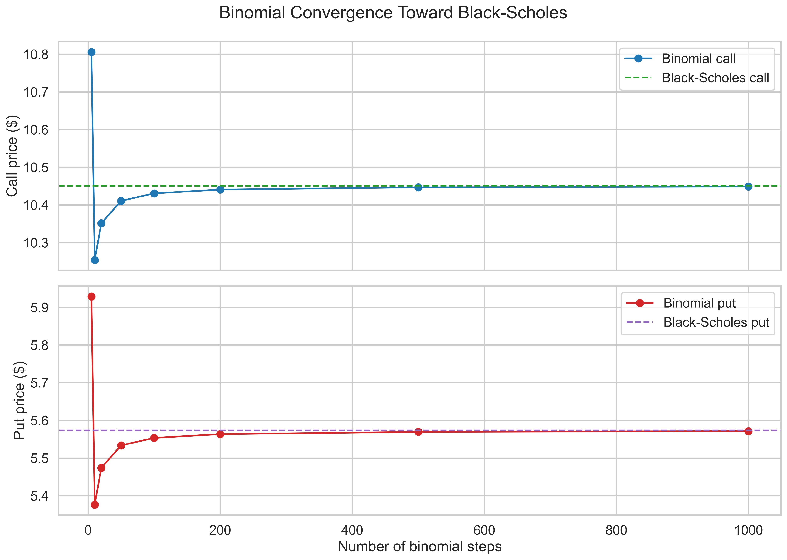
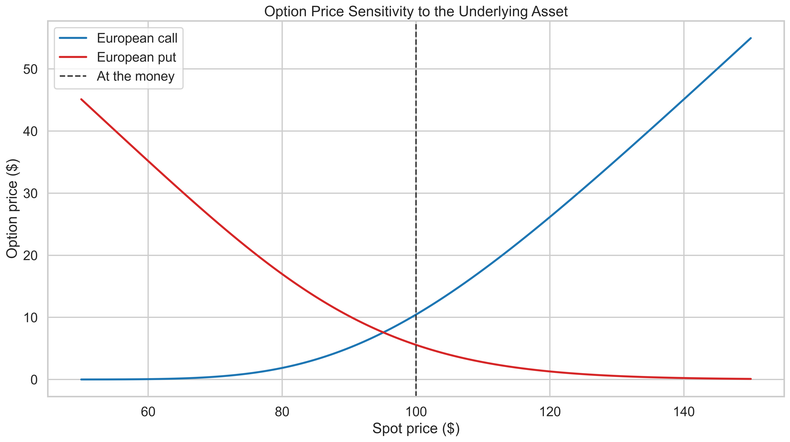
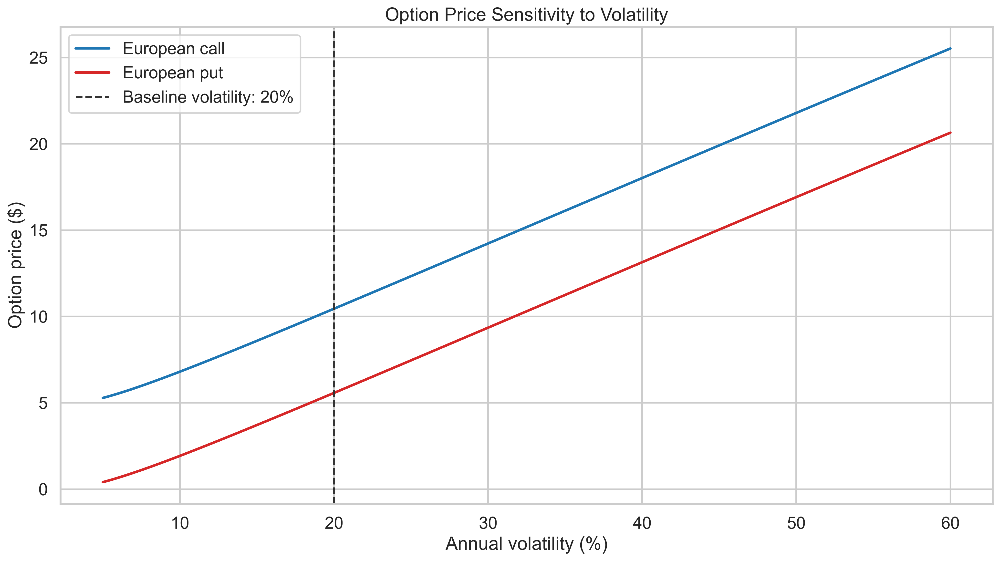
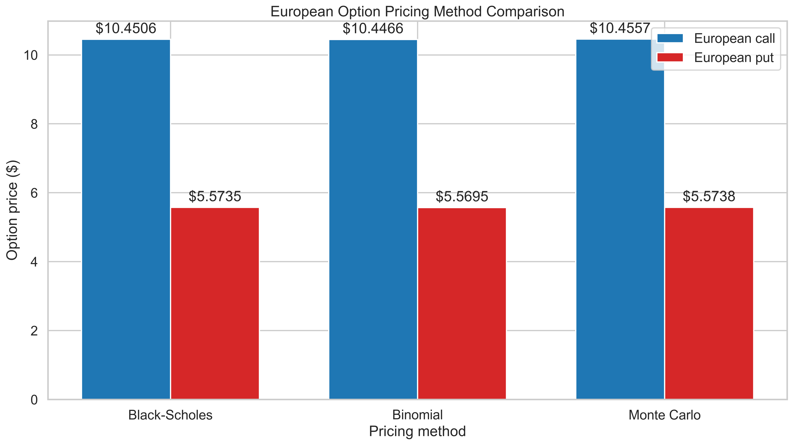

# Financial Options Pricing Engine

Motor cuantitativo para la valoración de opciones financieras mediante Black-Scholes, árboles binomiales, simulación Monte Carlo y griegas de opciones con Python.

Quantitative financial options pricing engine using Black-Scholes, binomial trees, Monte Carlo simulation, and option Greeks in Python.

---

## Español

### Descripción

Este proyecto implementa y compara tres métodos de valoración de opciones financieras:

1. Modelo analítico Black-Scholes.
2. Árbol binomial Cox-Ross-Rubinstein.
3. Simulación Monte Carlo neutral al riesgo.

El motor permite valorar:

- Calls europeas.
- Puts europeas.
- Calls americanas mediante árbol binomial.
- Puts americanas mediante árbol binomial.
- Opciones con dividendos continuos.

También calcula:

- Delta.
- Gamma.
- Vega.
- Theta.
- Rho.
- Paridad put-call.
- Error estándar de Monte Carlo.
- Intervalos de confianza.
- Sensibilidad al precio y la volatilidad.

El proyecto combina matemáticas financieras, derivados, probabilidad, métodos numéricos, estadística, visualización de datos, pruebas automatizadas e ingeniería de software.

---

### Caso base

| Parámetro | Valor |
|---|---:|
| Precio del activo | $100 |
| Precio de ejercicio | $100 |
| Tiempo al vencimiento | 1 año |
| Tasa libre de riesgo | 5% |
| Volatilidad anual | 20% |
| Dividendos | 0% |
| Pasos binomiales | 500 |
| Simulaciones Monte Carlo | 500,000 |
| Semilla aleatoria | 42 |

---

### Resultados principales

| Método | Call europea | Put europea |
|---|---:|---:|
| Black-Scholes | $10.4506 | $5.5735 |
| Árbol binomial | $10.4466 | $5.5695 |
| Monte Carlo | $10.4557 | $5.5738 |

Opciones americanas mediante árbol binomial:

| Opción | Valor |
|---|---:|
| Call americana | $10.4466 |
| Put americana | $6.0888 |

La call americana sin dividendos tiene aproximadamente el mismo valor que la call europea, porque normalmente no conviene ejercerla anticipadamente.

La put americana tiene mayor valor que la put europea debido al derecho de ejercicio anticipado.

---

### Modelo Black-Scholes

Los términos del modelo son:

$$
d_1 =
\frac{
\ln(S_0/K)
+
\left(
r-q+\frac{\sigma^2}{2}
\right)T
}{
\sigma\sqrt{T}
}
$$

$$
d_2=d_1-\sigma\sqrt{T}
$$

Call europea:

$$
C =
S_0e^{-qT}N(d_1)
-
Ke^{-rT}N(d_2)
$$

Put europea:

$$
P =
Ke^{-rT}N(-d_2)
-
S_0e^{-qT}N(-d_1)
$$

La metodología matemática completa se encuentra en:

[docs/methodology.md](docs/methodology.md)

---

### Griegas

| Griega | Call europea | Put europea |
|---|---:|---:|
| Delta | 0.636831 | -0.363169 |
| Gamma | 0.018762 | 0.018762 |
| Vega por 1% | 0.375240 | 0.375240 |
| Theta diario | -0.017573 | -0.004542 |
| Rho por 1% | 0.532325 | -0.418905 |

Las griegas cuantifican la sensibilidad del precio de la opción ante cambios en:

- Precio del activo.
- Volatilidad.
- Tiempo al vencimiento.
- Tasa libre de riesgo.

---

### Visualizaciones

#### Payoffs al vencimiento



#### Convergencia del árbol binomial



#### Sensibilidad al precio del activo



#### Sensibilidad a la volatilidad



#### Comparación de métodos



---

### Notebook

El notebook integra:

- Fundamentos matemáticos.
- Black-Scholes.
- Paridad put-call.
- Árbol binomial.
- Opciones europeas y americanas.
- Monte Carlo.
- Intervalos de confianza.
- Griegas.
- Comparación de métodos.
- Gráficos.
- Interpretación y conclusiones.

Puedes abrirlo en:

[notebooks/options_pricing_analysis.ipynb](notebooks/options_pricing_analysis.ipynb)

---

### Estructura del proyecto

```text
financial-options-pricing-engine/
├── docs/
│   └── methodology.md
├── notebooks/
│   └── options_pricing_analysis.ipynb
├── results/
│   └── figures/
│       ├── binomial_convergence.png
│       ├── method_comparison.png
│       ├── option_payoffs.png
│       ├── spot_price_sensitivity.png
│       └── volatility_sensitivity.png
├── src/
│   ├── __init__.py
│   ├── binomial_tree.py
│   ├── black_scholes.py
│   ├── greeks.py
│   ├── monte_carlo.py
│   └── visualization.py
├── tests/
│   ├── test_binomial_tree.py
│   ├── test_black_scholes.py
│   ├── test_greeks.py
│   └── test_monte_carlo.py
├── .gitignore
├── LICENSE
├── README.md
└── requirements.txt
```

---

### Responsabilidad de los módulos

| Archivo | Responsabilidad |
|---|---|
| `src/black_scholes.py` | Valora calls y puts europeas analíticamente. |
| `src/greeks.py` | Calcula Delta, Gamma, Vega, Theta y Rho. |
| `src/binomial_tree.py` | Valora opciones europeas y americanas. |
| `src/monte_carlo.py` | Valora opciones europeas mediante simulación neutral al riesgo. |
| `src/visualization.py` | Genera los gráficos del proyecto. |
| `docs/methodology.md` | Documenta los fundamentos matemáticos. |
| `notebooks/options_pricing_analysis.ipynb` | Presenta el análisis reproducible. |

---

### Instalación

#### 1. Clonar el repositorio

```bash
git clone https://github.com/acarrillofintech/financial-options-pricing-engine.git
cd financial-options-pricing-engine
```

#### 2. Crear el entorno virtual

Windows PowerShell:

```powershell
py -3.14 -m venv .venv
.\.venv\Scripts\Activate.ps1
```

Linux o macOS:

```bash
python3 -m venv .venv
source .venv/bin/activate
```

#### 3. Instalar las dependencias

```bash
python -m pip install --upgrade pip
python -m pip install -r requirements.txt
```

---

### Ejecución

Black-Scholes:

```bash
python -m src.black_scholes
```

Griegas:

```bash
python -m src.greeks
```

Árbol binomial:

```bash
python -m src.binomial_tree
```

Monte Carlo:

```bash
python -m src.monte_carlo
```

Visualizaciones:

```bash
python -m src.visualization
```

---

### Pruebas automatizadas

Ejecuta:

```bash
python -m pytest -v
```

El proyecto contiene **66 pruebas automatizadas** que validan:

- Valores conocidos de Black-Scholes.
- Cálculo de $d_1$ y $d_2$.
- Paridad put-call.
- Dividendos continuos.
- Griegas conocidas.
- Relaciones entre griegas de calls y puts.
- Precios binomiales.
- Convergencia hacia Black-Scholes.
- Ejercicio anticipado.
- Payoffs.
- Reproducibilidad Monte Carlo.
- Intervalos de confianza.
- Variables antitéticas.
- Validaciones de parámetros.

---

### Supuestos y limitaciones

Los modelos suponen:

- Volatilidad constante.
- Tasa libre de riesgo constante.
- Dividendos continuos.
- Mercados líquidos.
- Negociación continua.
- Ausencia de impuestos y costos de transacción.
- Precios lognormales.
- Posibilidad de venta en corto.

Los mercados reales pueden presentar volatilidad variable, saltos de precios, spreads, restricciones de liquidez y costos de negociación.

---

## English

### Overview

This project implements and compares three financial option pricing methods:

1. Black-Scholes analytical pricing.
2. Cox-Ross-Rubinstein binomial trees.
3. Risk-neutral Monte Carlo simulation.

The engine supports:

- European calls and puts.
- American calls and puts through binomial trees.
- Continuous dividend yields.
- Put-call parity.
- Option Greeks.
- Monte Carlo confidence intervals.
- Sensitivity and convergence analysis.

---

### Pricing methods

#### Black-Scholes

Provides a fast analytical benchmark for European options under constant volatility and interest-rate assumptions.

#### Binomial tree

Uses discrete-time backward induction and supports early exercise for American options.

#### Monte Carlo

Generates 500,000 risk-neutral terminal-price scenarios and estimates the discounted expected payoff.

Antithetic variates improve numerical stability, while the standard error and confidence interval quantify sampling uncertainty.

---

### Method comparison

| Method | Main advantage | Main limitation |
|---|---|---|
| Black-Scholes | Fast analytical solution | Restrictive assumptions |
| Binomial tree | Supports American exercise | Discretization and computational cost |
| Monte Carlo | Flexible probabilistic framework | Sampling error |

The three methods produce consistent European option values under the baseline assumptions.

---

### Technologies

- Python
- NumPy
- SciPy
- pandas
- Matplotlib
- Seaborn
- Jupyter
- pytest
- Git and GitHub

---

### Possible extensions

Future versions may include:

- Implied volatility.
- Volatility smiles and surfaces.
- Barrier options.
- Asian options.
- Digital options.
- Stochastic volatility.
- Jump-diffusion models.
- Finite-difference pricing.
- Market-data calibration.
- Interactive option-pricing dashboards.

---

## Author

**Alex Carrillo**

Financial Mathematics, Quantitative Finance, Risk Analytics, and Software Engineering.

---

## License

This project is distributed under the terms of the repository's [MIT License](LICENSE).

---

## Disclaimer

This project is intended exclusively for educational, academic, and analytical purposes.

The results are based on mathematical models, simulated data, and simplifying assumptions. They do not constitute financial, investment, legal, or professional advice.